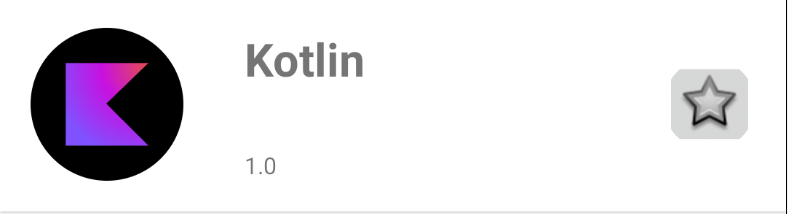

## 問題
1. 一覧カセットを少しみやすくレイアウトしたい。

## 要件
1. 下記の画像のようなレイアウトにする。

2. 制約のサイズは自由ですが、上下に適当なマージンを入れてください。

## ヒント
1. `cassette_user_item.xml`を触りましょう。
2. 画像を円形にくり抜くのは、`ImageFilterView`を使うと良い。(round attributeで角を円形に切り取れる)
> 参考 https://developer.android.com/reference/androidx/constraintlayout/utils/widget/ImageFilterView#imagefilterview-attributes

3. ImageViewには画像の要素が必要だが、`ResultsAdapter#L34`を参考にしてほしい。
   `Picasso.get().load({URL})`で画像を引いてきて、`.into({ImageView})`で画像をbindすることができる。

## 学び
例題でやってみた『制約の貼り方』を復習することで、AndroidStudioのLayoutEditorでのViewの実装ができるようになる。

## 実際の案件では
求人一覧のカセットの可読性を上げる案件がありました。
カセット内の画像の位置を変えたり、特定の情報を表す文字の文字色と太さを変更し、よりユーザに訴求しやすいようなカセットを作成したことがあります。