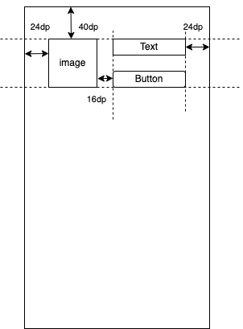

# 練習問題①
Viewを作りながら、制約を貼ることなどの勘所をざっと掴む。
1. さきほど作ったFragmentに次の要素を並べて表示させてみよう。
- TextView
- ImageView
- Button
2. 次の通りの制約を貼ってみよう。

※不十分なので、制約は補ってください。
3. ButtonをタップしたときにTextが切り替わるようにしましょう。

**ここでのポイントは、『制約の勘所をつかむ』です。**

