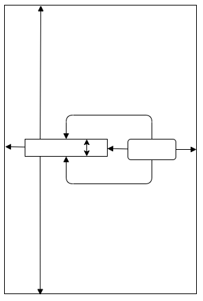

# AndroidにおけるUI
AndroidにおけるUIは「レイアウト」と「ウィジェット」の階層として作成されます。
- レイアウト
  - `ViewGroup` オブジェクトであり、子ビューを画面上にどのように配置するのかを制御するコンテナです。
- ウィジェット
  - `View` オブジェクトであり、ボタンやテキスト ボックスなどの UI コンポーネントを示します。


アプリケーションのファイル内部にこのツリー構造がXML形式のまま含まれており、
描画するタイミングでこのXMLを読み込みながら要素を取得し`View`オブジェクトに変換しています。

この章では、
1. AndroidStudioを用いて画面を生成してみる。
2. Viewオブジェクトに動的な値を入れてみる。

の２つをハンズオンと練習問題で実践しながらIDEの使い方とAndroidでのUIの実装について学びます。


### :computer: ハンズオン
- MainActivityにFragmentを追加	
- Fragmentに要素を追加する。	
  - Text
  - Button
- そこに制約を張る
- 実行する
  

## `res/`の中を見てみる
### layout
```xml
<?xml version="1.0" encoding="utf-8"?>
<androidx.constraintlayout.widget.ConstraintLayout
    xmlns:android="http://schemas.android.com/apk/res/android"
    xmlns:app="http://schemas.android.com/apk/res-auto"
    xmlns:tools="http://schemas.android.com/tools"
    android:layout_width="match_parent"
    android:layout_height="match_parent"
    tools:context=".ui.home.HomeFragment">

    <Button
        android:id="@+id/user_search_button"
        android:layout_width="wrap_content"
        android:layout_height="wrap_content"
        android:layout_marginStart="16dp"
        android:layout_marginEnd="16dp"
        android:text="@android:string/search_go"
        app:layout_constraintBottom_toBottomOf="@+id/input_search_word"
        app:layout_constraintEnd_toEndOf="parent"
        app:layout_constraintStart_toEndOf="@+id/input_search_word"
        app:layout_constraintTop_toTopOf="@+id/input_search_word" />

    <EditText
        android:id="@+id/input_search_word"
        android:layout_width="wrap_content"
        android:layout_height="wrap_content"
        android:layout_marginStart="16dp"
        android:layout_marginEnd="16dp"
        android:ems="10"
        android:hint="@string/search_input"
        android:inputType="textPersonName"
        android:minHeight="48dp"
        app:layout_constraintBottom_toBottomOf="parent"
        app:layout_constraintEnd_toStartOf="@+id/user_search_button"
        app:layout_constraintStart_toStartOf="parent"
        app:layout_constraintTop_toTopOf="parent" />
</androidx.constraintlayout.widget.ConstraintLayout>
```

### layoutのポイント

上記のレイアウトを模式的に図で表したものです。
constraintは、『どこを対象に』『どんな大きさ』の２つで決定されます。
上記の例だと、`EditText`は
- `app:layout_constraintStart_toStartOf="parent"`
    - 親の左端から、自分の左端までに制約を貼っていて、
- `android:layout_marginStart="16dp"`
    - それが16dpである

という制約になっています。


### values
```xml
<resources>
    <string name="app_name">MyGitHubApp</string>
    <string name="title_home">Home</string>
    <string name="title_dashboard">Dashboard</string>
    <string name="title_notifications">Notifications</string>
    <string name="search_input">input</string>
</resources>
```
直で文字をxmlに与えるのではなくて、一旦文字リソースを作ることが推奨されています。

## ActivityとFragment

## 制約について考える
### dpとsp、px
Android OSを積んでいる端末はたくさん存在します。
それぞれにさまざまな特徴があり、CPUやRAMも違えば、液晶サイズやその解像度もマチマチです。公開するAndroidアプリを実装するためには多種多様な端末で描画しても崩れない実装を心がける必要がありますが、そのための工夫のうちの一つに、特殊な単位`dp`、`sp`が存在します。

それぞれ、`density-independent pixel`、`scale-independent pixel`の略ですが、画面密度に依存しない形で要素やシステムフォントのサイズを指定できる単位です。

明示的に制約や要素のサイズを指定する際は、`dp`, `sp`を用います。

#### 画面密度


#### 用途
単位 |用途
:--- |:---
px| 基本的に使わない
dp| 画像リソースのサイズ指定や、制約の絶対値指定に利用
sp| システムフォントのサイズに利用 

> 出典: https://developer.android.com/training/multiscreen/screendensities

### 要素の位置
ある要素を描画する上で、その要素が画面上のどこに位置するのかを指定する必要があります。より詳しくいうと、ある要素がその親の要素からみてどれぐらいの位置に存在するのかを指定する必要があります。

### 要素のサイズ
ある要素を描画するためには、制約の他に要素自身のサイズを指定することも必要になります。要素のサイズは大きく３種類指定する方法があります。
1. wrap content
2. match parent
3. 絶対値指定

です。それぞれについて見ていきます。
#### 1. wrap content
自分自身のサイズに基づいてサイズを決定します。
画像要素であれば、それ自身のサイズと認識するとわかりやすいでしょう。ViewGroupも子供として含んでいる要素を丸々ラップした全体の大きさで自分自身のサイズを測定できるので、それがwrap contentした場合の大きさになります。

#### 2. match parent
親要素のサイズに合わせるサイズの決定方法です。例えば、横幅いっぱいに描画したい場合は、match parentで指定することで、要素のサイズによらず、横幅いっぱいに表示することができます。

#### 3. 絶対値指定
最も明確で、内部で計測処理が必要ない方法が絶対値指定です。
要素のサイズを実数値で指定することができます。


目的により使い分けていくことで、目的のレイアウトを達成します。

### :computer: ハンズオン
- Textの文字を設定する
- ButtonにListenerを設定する

## Viewを呼び出してみる
リソースはリソースのままコンパイルされます。idや制約はバイナリ化されますが、構造は実装時のXMLとほぼ同様です。
実装から呼び出す際は、これらのXMLから`View`オブジェクト、あるいは`ViewGroup`オブジェクトに変換する必要があります。
これを担っているのが`LayoutInflator`というクラスです。
LayoutInflatorによってinflateされたLayoutはViewクラスのオブジェクトに変換されています。
ここで生成されたトップレベルの`View`オブジェクトから、子要素を取り出すために、`findViewById`というメソッドがViewクラスに定義されています。
XMLの中に記載されているIDを元に、ソースコードから編集できるViewオブジェクトを取り出します。

### findViewById
layoutの内部要素に対して特定の操作をする際、ソースコードから要素を取得する必要があります。
```kotlin
class LoginFragment : Fragment() {

    private lateinit var usernameEditText: EditText
    private lateinit var passwordEditText: EditText
    private lateinit var loginButton: Button
    private lateinit var statusTextView: TextView

    override fun onViewCreated(view: View, savedInstanceState: Bundle?) {
        super.onViewCreated(view, savedInstanceState)

        usernameEditText = view.findViewById(R.id.username_edit_text)
        passwordEditText = view.findViewById(R.id.password_edit_text)
        loginButton = view.findViewById(R.id.login_button)
        statusTextView = view.findViewById(R.id.status_text_view)
    }
}
```

### ViewBinding
全ての要素に対してfindViewByIdを宣言して変数を初期化するのは大変で、ボイラープレートを増やします。
昨今では、ViewBindingを用いて、layoutから自動的に変数を初期化したBindingを用いることができるようになっています。

ビュー バインディングとは、ビューを操作するコードを簡単に記述できる機能です。
モジュール内でビュー バインディングを有効にすると、そのモジュール内に存在する XML レイアウトファイルごとにバインディングクラスが生成されます。
バインディング クラスのインスタンスには、対象レイアウト内で ID を持つすべてのビューへの直接参照が組み込まれます。

`fragment_home.xml`に対して、`FragmentHomeBinding`というクラスが自動生成されています。
> https://developer.android.com/topic/libraries/view-binding?hl=ja

```kotlin
class HomeFragment : Fragment() {
    override fun onCreateView(
        inflater: LayoutInflater,
        container: ViewGroup?,
        savedInstanceState: Bundle?
    ): View {
        _binding = FragmentHomeBinding.inflate(inflater, container, false)
        val root: View = binding.root

        val searchWord: EditText = binding.inputSearchWord
        val searchButton: Button = binding.userSearchButton
        searchButton.setOnClickListener{
            // set.
        }
        return root
    }
}
```

## Appndix
エンハンス体験用のproject内部では、layoutやstringリソース以外に、munuやnavigationもXML形式で書かれています。
### menu 
```xml
<?xml version="1.0" encoding="utf-8"?>
<menu xmlns:android="http://schemas.android.com/apk/res/android">
    <item
        android:id="@+id/homeGraph"
        android:icon="@drawable/ic_home_black_24dp"
        android:title="@string/title_home" />
    <item
        android:id="@+id/navigation_dashboard"
        android:icon="@drawable/ic_dashboard_black_24dp"
        android:title="@string/title_dashboard" />
</menu>
```
BottomNavigationで呼ばれるリソースの集合ですね。

### navigation (色々省略)
```xml
<?xml version="1.0" encoding="utf-8"?>
<navigation 
    android:id="@+id/mobile_navigation"
    app:startDestination="@+id/homeGraph">
    <navigation android:id="@+id/homeGraph" app:startDestination="@id/navigation_home">
        <fragment
            android:id="@+id/navigation_home" tools:layout="@layout/fragment_home" >
            <action android:id="@+id/action_navigation_home_to_resultsFragment" app:destination="@id/user_results" />
        </fragment>
        <fragment
            android:id="@+id/user_results" tools:layout="@layout/fragment_user_results" >
            <argument android:name="query_user_name" app:argType="string" />
        </fragment>
    </navigation>
</navigation>
```

### navigationのポイント
- どこからどこに遷移するかが示されています。
- navigation/fragment/actionそれぞれにidが付与されていて、ソースコードから触れるようになっています。
- fragmentにargumentを持たせることができて、ここではquery_user_nameというstringの値を持って、検索一覧画面を起動することになってます。


