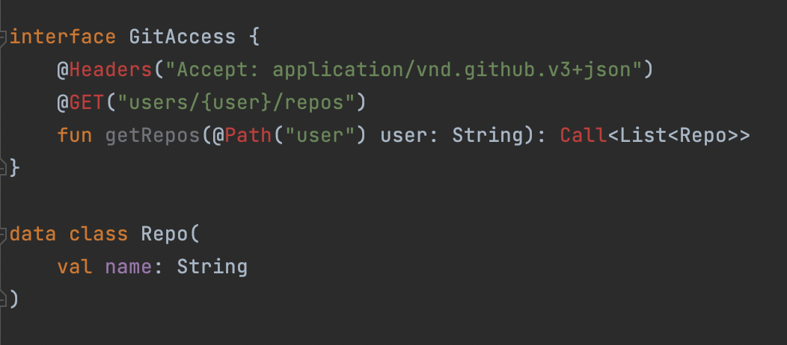
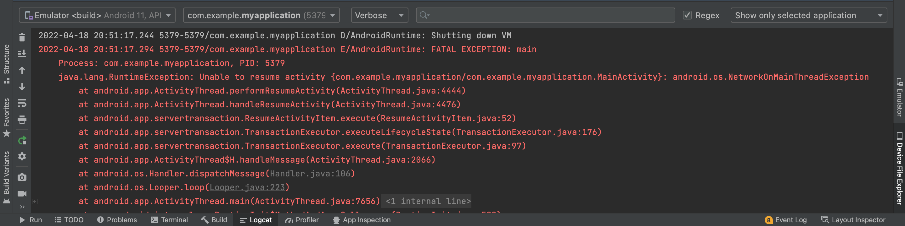

# Androidから外部リソースへのアクセス
ここまではUIについて見てきました。ここから先は、描画させるデータについて考えていきましょう。

ほとんどのアプリケーションは、DBやAPI、ファイルサービスとのやりとりをします。
例えばデータのほとんどはサーバー側で持っていて、そこにアクセスすることでデータを取得したり、端末に保持した永続データベースにアクセスすることでデータを取得したり、カメラActivityを起動してアプリから画像を操ったりします。

こういった外部とのアクセスの多くは、ライブラリが整備されているので、それを用いることが多いです。
今回はRetrofitを用いてAPIアクセスをしながら学んでいきましょう。

ここまで終われば、データを外部から取得して、そのデータを描画するアプリケーションを実装できるようになります！

## 写経してみる
GitHub APIにアプリからアクセスしてみます。
自分のGithub IDをハードコードして、レポジトリを取得したいです。
早速書いていきましょう。

1. 新しいKotlinクラスファイルを作成します。
2. 下記を写経してください。

```kotlin
interface GitAccess {
    @Headers("Accept: application/vnd.github.v3+json")
    @GET("users/{user}/repos")
    fun getRepos(@Path("user") user: String): Call<List<Repo>>
}

data class Repo(
    val name: String
)
```

3. 先ほどまでに作っていたFragmentのonResumeを下記にしましょう。

```kotlin
override fun onResume() {
    super.onResume()
    val retrofit = Retrofit.Builder()
        .baseUrl("https://api.github.com/")
        .addConverterFactory(GsonConverterFactory.create())
        .build()

    val service = retrofit.create(GitAccess::class.java)
    val repos = service.getRepos("自分のIDとか").execute()
    Log.e("Info", repos.body().toString())
}
```

### 下記のようになっているはずです。


**正しく依存関係が記載されていれば**この赤字の上にカーソルを当てて、`Opt + Enter`でimportするパッケージをサジェストしてくれます。
但し、今は依存関係が記載されていません。この辺りのお話をするために、先に次の章に進むことにしましょう。

### build.gradleに依存関係を追加する
```groovy
implementation 'com.squareup.retrofit2:retrofit:2.9.0'
implementation 'com.squareup.retrofit2:converter-gson:2.9.0'
```
を追加しましょう。

そのあと、

を選択して、GradleがSyncされるのを待ちます。

終わり次第、[写経してみる#1]で作ったファイルに戻ってみると、
> **正しく依存関係が記載されていれば**この赤字の上にカーソルを当てて、`Opt + Enter`でimportするパッケージをサジェストしてくれます。

ができるはずです。

パッケージのimportが終わったらRunしてみましょう。

### クラッシュする
おそらく実行してもクラッシュします。
`android.os.NetworkOnMainThreadException`という例外が出力されています。



※ Logcatにログが出力されているので見てみましょう。

この例外は、
> https://developer.android.com/reference/android/os/NetworkOnMainThreadException

ここで表されている通り、メインスレッドからネットワーク通信をしようとしたことで発生しています。別のスレッドから実行するようにしましょう。

**:point_right: ProcessとThreadのお話**

### 写経する
先ほどのonResumeのコードを下のように修正します。
```kotlin
override fun onResume() {
    super.onResume()
    Thread {
        val retrofit = Retrofit.Builder()
            .baseUrl("https://api.github.com/")
            .addConverterFactory(GsonConverterFactory.create())
            .build()

        val service = retrofit.create(GitAccess::class.java)
        val repos = service.getRepos("自分のIDとか").execute()
        Log.e("Info", repos.body().toString())
    }.start()
}
```

再度実行してみましょう。

### またクラッシュする
今度は、`java.lang.SecurityException: Permission denied (missing INTERNET permission?)`という例外が投げられています。Permissionとは何なのでしょうか。

ここで、先に5章に移ります。

### AndroidManifestにpermissionを追加する
```xml
<uses-permission android:name="android.permission.INTERNET" />
```
を追加して実行してみましょう。

Logcatにアクセス結果が返っていれば成功です。


## まとめ
Retrofitを使いましたが、詳しい利用方法は公式のドキュメントを見ましょう。また、エンハンス体験で使うサンプルアプリにもRetrofitを用いたAPIアクセスは使っているので、そちらの実装を見てみるのも良いでしょう。

データアクセスはこの通り、パーミッションを適切に設定したり、実行するThreadを気にしたりする必要があります。公式のドキュメントを読む、クラッシュログを読むなどをしながら、学んでいきましょう。


## Appendix
### Retrofitを用いたAPIアクセス
> https://square.github.io/retrofit/


### Roomを用いた永続DBへのアクセス
> https://developer.android.com/training/data-storage/room?hl=ja

### SharedPreferenceを用いたKey-Value保存とアクセス
> https://developer.android.com/reference/kotlin/android/content/SharedPreferences?hl=ja

現在は、DataStoreというライブラリの利用をGoogleは推奨しています。
> https://developer.android.com/topic/libraries/architecture/datastore?hl=ja
