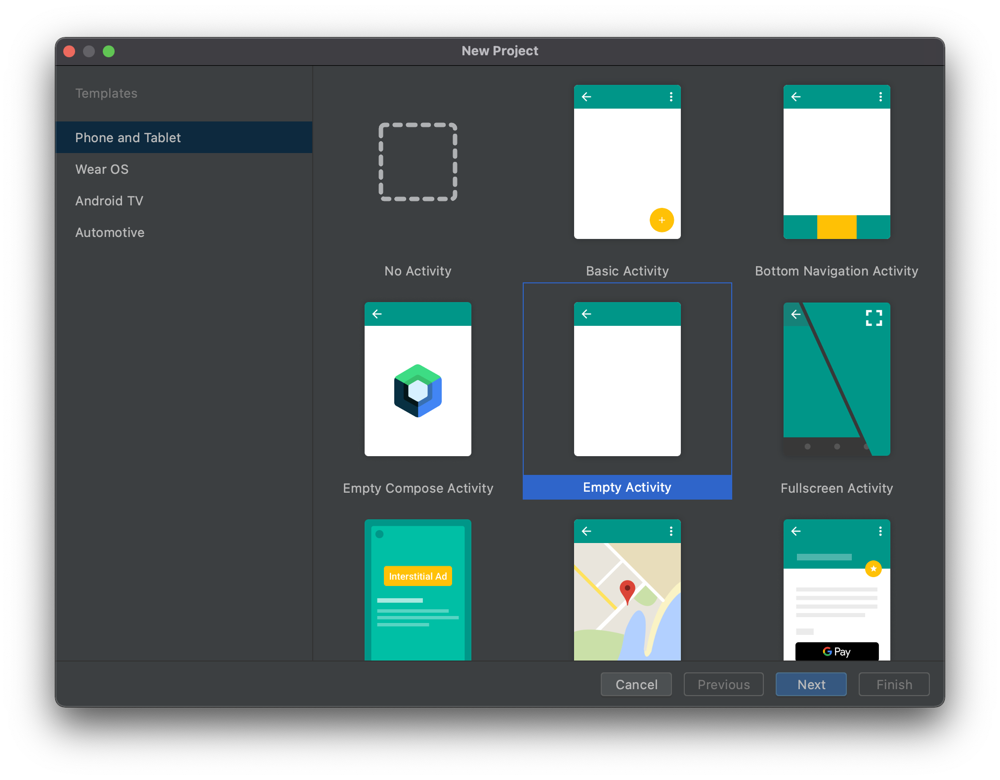
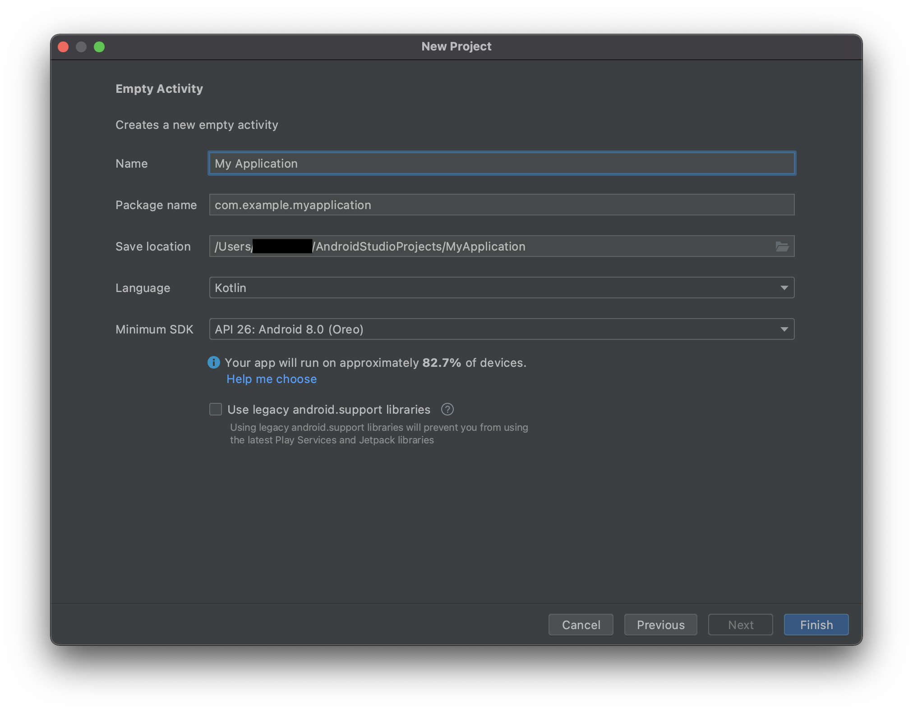
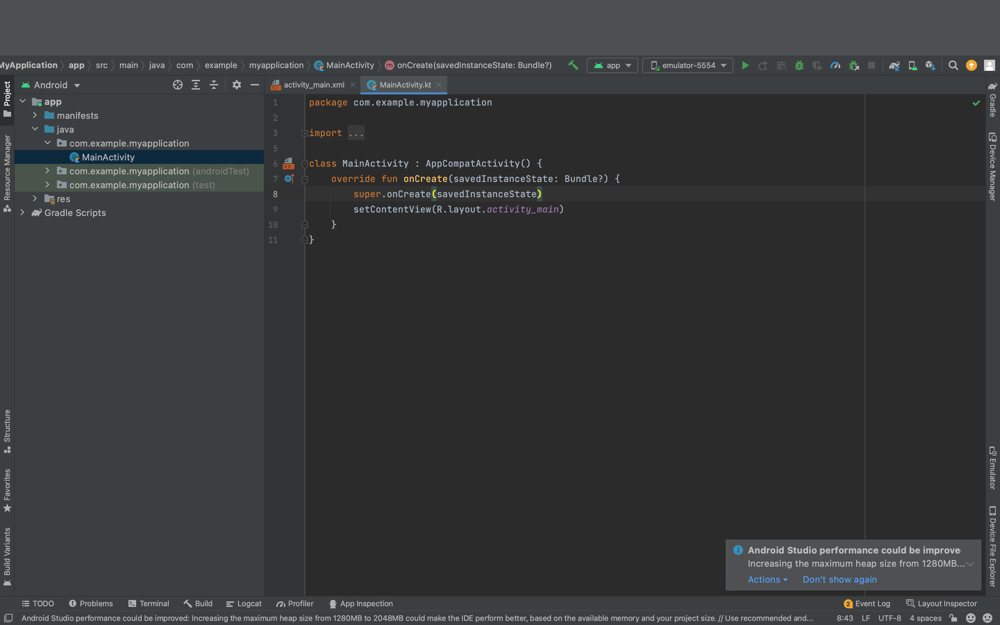

# Androidアプリ開発
このパートでは、実際にAndroid Studioを使いながら、

1. Android Studioの使い方
2. Android projectのディレクトリツリー構造
3. 各ファイル・ディレクトリが何の役割を果たしているか

を学んでいきます。

この後、アプリのエンハンス体験をする際に必要になる動作方法なので、困ったときはこの章やこの章で解いてみる例題に立ち戻ってください。

## ゴール
エンハンス体験をする際に、何か目的をもって変更しようとして、ソースコード以外の部分で困ることがないことが目標です。
どこにファイルを追加したらいいかがわかる、また、どこにソースコードを書けばいいかがわかることを現実的な目標とします。

## それぞれの単元について
内容 |目的とゴール
:---|:---
1 [UI](./1.UI)|IDEを使ったUIの実装ができるようになる。
2 [Lifecycle](./2.LifeCycle)|アプリケーションのライフサイクルを知り、処理を適切な箇所にかけるようになる。
3 [DataAccess](./3.DataAccess)|APIアクセスやDBへのアクセスを学び、データを取得できるようになる。
4 [AndroidManifest](./5.AndroidManifest)|アプリケーションの設定を知り、パーミッションやIntentのことがわかるようになる。
5 [build.gradle](./4.build.gradle)|ビルドで何が起きているかを理解し、依存関係やFlavorの存在を知る。
6 [Testing](./6.Testing)|Androidにおけるテストコードがどこにあるのかを知り、テストファイルを置けるようになる。

## 環境構築
まずは、新規のプロジェクトを立ち上げます。

Empty Activityを選択して、Nextをクリックします。

要素 |設定値
:---|:---
Name | 任意
Package name| 自動生成
Save Location | 任意
Language| Kotlin
Minimum SDK| Android 8.0

でFinishを選択します。

この画面が表示されれば一旦OKです。

### Edit Configurations
下記状態であることを確認して下さい。

※ 『app▼』が表示されていればOKです。

表示されていない場合は、『add configuratons』を選択して、configurationを設定します。

## 最低限知っておきたいAndroid Studioのコマンド・操作
困ったときに立ち返ってください。

操作|IDEでの操作|ショートカットコマンド
:---|:---|:---
新規ファイル作成|右クリック→New|
Run|Run→Run app or ▶︎ボタン| Shift + F10
宣言ジャンプ|Navigation→Declaration or Usage|⌘ + B
使用箇所|   Navigation→Declaration or Usage|⌘ + B
実装ジャンプ|Navigation→Implementation|Opt + ⌘ + B

