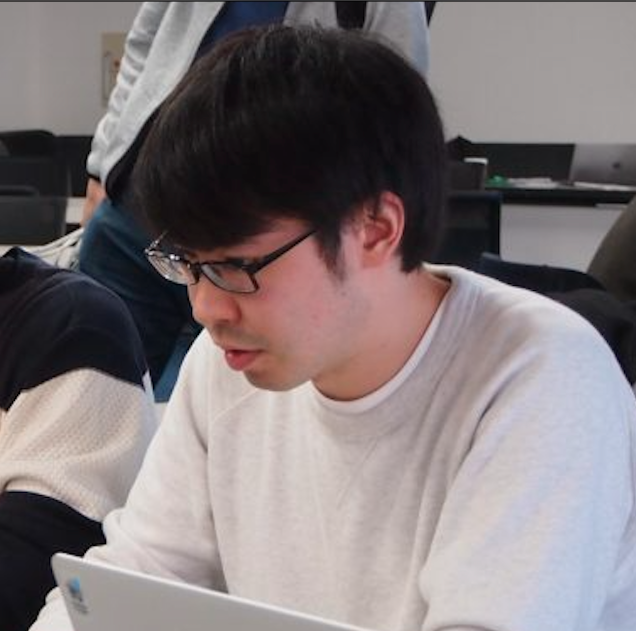
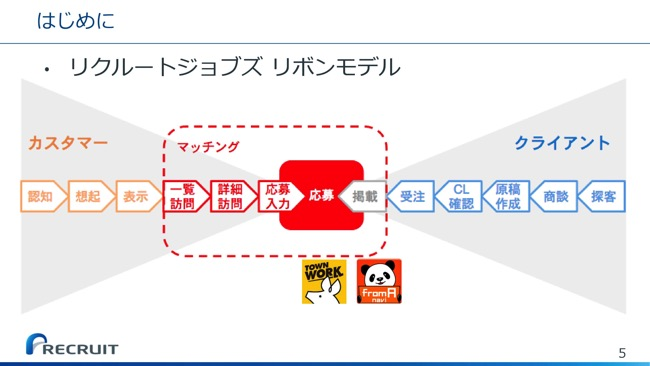
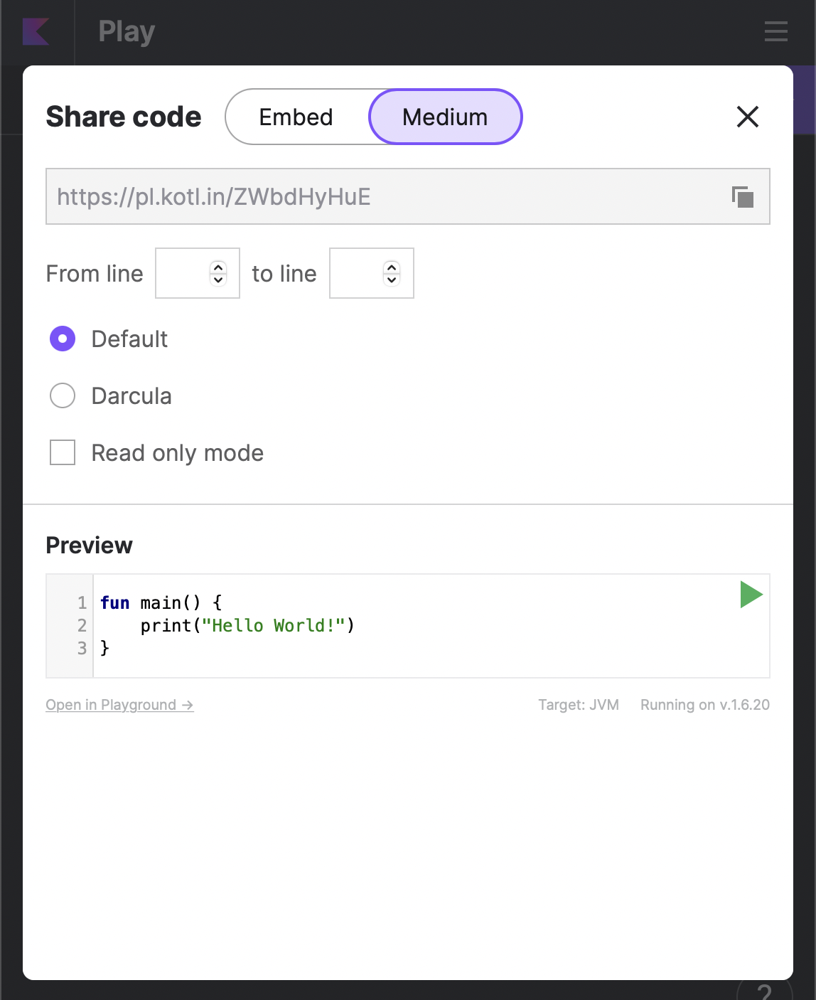

# BootCamp2022 Android講習

---
# 二日間の目的とゴール
## 目的
- Androidチーム配属のときに摩擦なく開発を始められる前提知識を身につける。
## 詳細
- 現場で使う：「アプリを作れるようになる」ではなく、「アプリチームで働く一助になる」こと。
- 摩擦なく：必要になった時にこの講義に立ち返ると学びの一歩目が得られる。
- 前提知識：Androidアプリがどうやって動いているか、どこに気をつけて開発する必要があるかの肝を知る。

---
## 講師紹介

- 名前：河内友佑(2020年入社)
- 所属：HRプロダクト開発2G
- 担当：タウンワークAndroid

---
## 講師紹介

- 名前：石井潤(2018年入社)
- 所属：HRプロダクト開発2G
- 担当：タウンワークiOS/Android


---
## 現場での仕事の解像度を上げる
### タウンワークって？




> 引用元 [タウンワーク90万原稿の掲載を支えるレガシーバッチチューニング](https://speakerdeck.com/rtechkouhou/taunwaku90mo-yuan-gao-falsejie-zai-wozhi-eruregasibatutipahuomansutiyuningu-number-devsumi-number-devisumid)


---
## アプリが価値を生む


### 例① エンハンス開発
:one: 価値が生まれるまでの時間を短く
:two: 生まれる価値を上げ (スコープ外)
:three: 障害を出さないよう
にリリースすること

> 引用元 [事業価値とエンジニアリング](https://speakerdeck.com/rtechkouhou/shi-ye-jia-zhi-to-enziniaringu?slide=22) 61期リクルート新人研修


---
## アプリが価値損失を防ぐ


### 例② 安定稼働タスク
検知からリリースまでを最速
:one: 見つける
:two: 原因の切り分け
:three: 解決策
:four: 修正→リリース

> 引用元 [事業価値とエンジニアリング](https://speakerdeck.com/rtechkouhou/shi-ye-jia-zhi-to-enziniaringu?slide=22) 61期リクルート新人研修


---
## "エンハンス開発"の価値を最大化するのに必要なこと


---
## "安定稼働タスク"を実施するのに必要なこと


---
# 二日間の目的とゴール(再掲)
## 目的
- Androidチーム配属のときに摩擦なく開発を始められる前提知識を身につける。
## 詳細
- 現場で使う：「アプリを作れるようになる」ではなく、「アプリチームで働く一助になる」こと。
- 摩擦なく：必要になった時にこの講義に立ち返ると学びの一歩目が得られる。
- 前提知識：Androidアプリがどうやって動いているか、どこに気をつけて開発する必要があるかの肝を知る。


---
## 現場で使うとは
いろいろと気を遣う部分があります。
Android開発ができるという一般的なスキル以外にも
1. 開発フローの話：チーム開発・案件の策定からリリースまでのフロー
2. 既存コードの理解：技術的負債(ソースコードの負債・古いライブラリ)
3. プロダクトの理解・仕様理解
4. 障害対応
5. OS/IDEの最新版追随対応：非推奨対応
6. 肥大するコードへの対応：ビルド時間問題・潜在的なリスク

などへのケアが必要です。


---
## 摩擦なく
Android開発において必要な知識や用語を満遍なく知ることによって、必要になった際に、「何を学べばいいか」がわかっている状態になることが目標です。そのために、アプリ開発や言語の知識だけでなく、ところどころで実際にあった事象を例に小噺を差し込み、「そんなことがあるんだ」という導入の部分だけでも知っておいてもらうことを意識しています。


---
## 前提知識
Android開発ができるようになる上で、知っておくべきことは多岐にわたります。
1. 言語知識：Kotlin/Java (そのほかにも環境によってはGroovyなど)
2. IDE知識：Android Studioの使い方を知る必要があります。
3. アプリ開発基礎知識：UI、ロジックの実装方法、データストアの方法など
4. Androidの動き方：スレッドがどう動くのか、どこで非同期処理を操るかなど

こういった部分の始まりの部分を２日間に詰め込み、「やったことあるな」という状態にしておくことを意識しています。


---
# コンテンツ
- 初日：
  - 導入
  - Kotlinの基礎(２時間ぐらい) [座学＋実際に触る] 
  - Android開発の基礎(２時間ぐらい) [座学＋実際に触る]
  - エンハンス体験 [実際に触る]
- 二日目：
  - エンハンス体験 [実際に触る]
  - ところどころ小噺
  - クロージング

---
# 講習中のお願い・注意事項
3. チャットはSlackに統一します。発言自由にするので、質問や進捗報告、わかったアピール、わからないアピールなど何にでも使ってください。
4. 座学中・演習中問わず、常に口頭での質問で遮ってください。歓迎です。
5. 受講者の間で意見を交換するのも、会話をするのも自由です。
6. グループ分けはしません。

---
# コンテンツ詳細
## Kotlinの学習
- 目的
  - 後続のコンテンツ(エンハンス体験)をする際に「知らない・読めない」を極力なくする程度の必要最低限レベルを習得すること
- ゴール
  - スムーズに書けなくても、例題やリファレンスに立ち返ればわかる、どこを質問すればいいかわかるぐらいになる

---
## Androidアプリ開発の基礎
- 目標
  - エンハンス体験をする際に、何か目的をもって変更しようとして、ソースコード以外の部分で困ることがないこと
- ゴール
  - どこにファイルを追加したらいいかがわかる、また、どこにソースコードを書けばいいかがわかること

---
## Android OSの話
- 目標
  - 価値の最大化・損失の最小化をするための第一歩。
- ゴール
  - 「Androidってそういうことがあるのか」と何となく頭の中に残ることです。

ところどころでAndroid OSに関する小ネタを挟みます。
昨今のライブラリを上手に活用すると意識しなくてすむ部分が多いのですが、歴史の長いプロダクトであればあるほど古い基盤に依存しているものが多いです。
ある程度OSがどういう処理をしているのかを知っていないと、実装上思わぬ危険性を埋め込むことになったり、実行時エラーが発生してクラッシュしたりすることがあります。途中からエンハンス体験中心になりますが、定期的に小ネタを挟みながら、実際にアプリケーションを作る際に気にするべきところを学んでいきましょう。

---
## エンハンス体験(メインコンテンツ)
- 目標
  - 「実際の案件っぽい」テーマのエンハンスをしてみることによって、Android開発の基礎がわかり、満遍なく一度調べたこと・触ったことがあるという状態になること
- ゴール
  - いずれAndroid開発に関与することになったときに、既存実装を追いやすくなること、簡単な案件であれば摩擦なく実施できること

---
# コンテンツ(再掲)
- 初日：
  - 導入
  - → Kotlinの基礎(２時間ぐらい) [座学＋実際に触る] 
  - Android開発の基礎(２時間ぐらい) [座学＋実際に触る]
  - エンハンス体験 [実際に触る]
- 二日目：
  - エンハンス体験 [実際に触る]
  - ところどころ小噺
  - クロージング


---
# 環境構築の確認

---
# はじめる前に
## 環境確認
### 必要なもの
- Android Studio (2021.1.1以上)
  - Android Emulator
- GitLabの権限

### 動作確認
- Android Emulator
  - AVDを使ってEmulatorを追加してみる


---
# Kotlinの基礎


---
# Why Kotlin?
## Kotlinとは
JetBrain社が開発したオープンソースの静的型付け言語。
Java仮想マシン上で動作するので、Javaと同程度に早くコンパイルされ動作される。
Javaとの互換性を残しつつ、Java内の互換性維持のためJavaでは実現できない機能を追加したり、将来的にJavaで実現したいことを先読みして採用したり、Scalaから関数型言語の良さの一部を採用したりしている。(糖衣構文など)
2019年にGoogleがKotlinをAndroid開発の推奨言語に指定した。
(※ ここまでwikipedia)

---
# Why Kotlin?
## 公式ページに行ってみよう
> Kotlin
> https://kotlinlang.org/#why-kotlin
 
> Develop Android with Kotlin
> https://developer.android.com/kotlin?hl=ja


---
# Kotlin研修の進め方
## GitLabとKotlin Playgroundで進めます
1. [GitLab](https://gitlab.recruit-tech.co.jp/r_kawauchi_yusuke/bootcamp_android) の`lesson/kotlin`を開いて下さい。
2. テーマごとのディレクトリに`README.md`が含まれています。
3. 各章について、本当に簡単に説明します。
4. その後各自で各章の内容を読み、練習問題に取り組んでください。
5. 練習問題の回答をSlackのチャットで共有してください。
6. 追加の説明事項があれば補足した上で、次の章に進みます。
7. 2-6を繰り返します。

---
## Kotlin Playgroundについて
### 開き方
> 練習問題 https://pl.kotl.in/dzgYxklC4?theme=darcula


`Open in Playground →`を選択する。

---
## Kotlin Playgroundについて
### 実行方法

の`▶︎` を選択

---
## Kotlin Playgroundについて
### 共有方法

`<>` を選択すると、右のようなダイアログが出現するので、
`Medium`を選択してその下のURLをコピーする。

---
# ハンズオン開始
GitLabに移ります。
ここからは『通話 + ハンズオン』

---
# コンテンツ(再掲)
- 初日：
  - 導入
  - Kotlinの基礎(２時間ぐらい) [座学＋実際に触る] 
  - → Android開発の基礎(２時間ぐらい) [座学＋実際に触る]
  - エンハンス体験 [実際に触る]
- 二日目：
  - エンハンス体験 [実際に触る]
  - ところどころ小噺
  - クロージング

---
# Android開発の基礎
GitLabに移ります。
ここからは『通話 + ハンズオン』


---
# コンテンツ(再掲)
- 初日：
  - 導入
  - Kotlinの基礎(２時間ぐらい) [座学＋実際に触る] 
  - Android開発の基礎(２時間ぐらい) [座学＋実際に触る]
  - → エンハンス体験 [実際に触る]
- 二日目：
  - エンハンス体験 [実際に触る]
  - ところどころ小噺
  - クロージング


---
# Androidエンハンス体験
## 実際にソースコードを触ってみよう
ここでは、サンプルアプリを使って実際にAndriodアプリの機能追加をしていきます。
1. まずアプリの中身を覗いてみる
2. 実際にちょっと触ってみる
3. Issueベースでどんどん進めていく

という流れで進めていきましょう。

---
# MyGithubApp
## 今回のお題について
今回お題として準備したのは、GitHubAPIを利用した簡単な検索アプリです。
講師陣が普段触っているタウンワークもそうですが、リクルートが提供しているクライアント向けアプリは、
「検索」→「一覧表示」→「詳細表示」→「アクション」
という動きをするものが多いです。(リクルートに限りませんが)
なので、今回はその動きを模したアプリを使って、実際に現場で発生しそうなテーマを実装しながら、Android開発について学んでいきましょう。

---
# 環境構築
## GitLabから引っ張ってくる
:one: リポジトリをフォークしてください。
:two: 立ち上げます
```shell
$ cd 任意の場所
$ git clone hogehoge
$ cd MyGithubApp
$ studio . 
```
で立ち上がります。

(`studio`コマンドを使うために)
※ AndroidStudio側で、`Tools→Create Command-line Launcher`をクリック→OKを選択ください。

---
## 実際に動かしてみる

:three: ▷をクリックして起動する。


---
# ここからはたくさん書いて触れ合ってみましょう
## 開発体験
### 進め方
1. GitLabのIssueが課題になります。順番に進めていってください。
2. いつでも質問対応するので、メンションをください。

おすすめ問題 (これをやればまんべんなくいろいろ見れる)
＊ [Issue1](https://github.com/recruit-tech/bootcamp-2022-android/blob/main/issues/issue1.md) ＊ [Issue4](https://github.com/recruit-tech/bootcamp-2022-android/blob/main/issues/issue4.md) ＊ [Issue7](https://github.com/recruit-tech/bootcamp-2022-android/blob/main/issues/issue7.md) ＊ [Issue10](https://github.com/recruit-tech/bootcamp-2022-android/blob/main/issues/issue10.md) ＊ [Issue12](https://github.com/recruit-tech/bootcamp-2022-android/blob/main/issues/issue12.md)

※当日はGitLabで実施しました。公開用に[GitHub](https://github.com/recruit-tech/bootcamp-2022-android)に移行しているのでこちらをご覧ください。

---
### ルール
1. issueそれぞれに対して、`enhance/issue{number}`を切って`main`ブランチへのPRを作成してください。
2. PRが作れたら、メンションしてください。
3. 講師が確認し、共有できそうなところや補足があれば共有します。
4. みんなの間での会話、何か調べ物をする行為などは自由です。
5. お昼休みは明示的に取ります。それ以外の細かい休憩は各自で取得して下さい。

---
## Issueの見方


:one: **問題**
今の状態での困りごと
:two: **要件**
やってほしいこと
:three: **ヒント**
参考になるスライドページなど
:four: **学び**
この案件で学べること
:five: **実際の業務では**
実際にあった似たような案件


