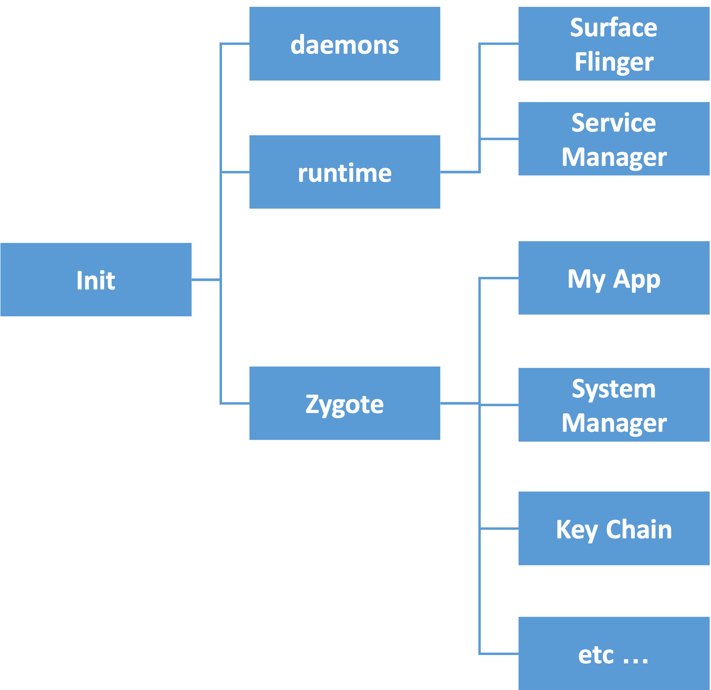

# BootCamp2022 Android講習


---
# クロージング


---
# まとめ
Androidチーム配属のときに摩擦なく開発を始められる前提知識を身につける。
:one: **Kotlinの基礎**
後続のコンテンツ(エンハンス体験)をする際に「知らない・読めない」を極力なくする程度の必要最低限レベルを学習しました。
:two: **Androidの基礎**
IDEの使い方や、新しいソースコードの追加、ビルド設定、AndroidManifestなど、Android特有の知っておくべきことを満遍なく学びました。
:three: **Androidエンハンス体験**
「実際の案件っぽい」テーマのエンハンスをしてみることによって、Android開発の基礎がわかり、経験を通してAndroid開発の初歩を学びました。


---
## もっと知る
### 公式のリソース
公式の情報がたくさん存在する。
[Developer's Guide](https://developer.android.com/docs?hl=ja) 公式のガイドに技術の紹介やコードサンプルがたくさん
[Cources](https://developer.android.com/courses?hl=ja) Android開発のトレーニングツール(チュートリアル)が提供されている
[Kotlin](https://kotlinlang.org)
[Kotlin リポジトリ](https://github.com/JetBrains/kotlin)
### サンプルAppリポジトリ
[Sunflower](https://github.com/android/sunflower)
[Now in Android](https://github.com/android/nowinandroid)

---
### 興味がある人はこういったところも見てみましょう
:one: UI [1](https://developer.android.com/guide/components/activities/intro-activities?hl=ja), [2](https://developer.android.com/design/index.html), [3](https://developer.android.com/guide/practices/screens_support), [4](https://developer.android.com/guide/index.html)
:two: アーキテクチャ [1](https://www.youtube.com/watch?v=fodD6UHjLmw), [2](https://developer.android.com/jetpack/guide?hl=ja), [3](https://www.youtube.com/watch?v=p9VR8KbmzEE), [4](https://www.youtube.com/watch?v=gIhjCh3U88I)
:three: テスト [1](https://developer.android.com/training/testing?hl=ja), [2](https://goyoki.hatenablog.com/entry/20120301/1330608789), [3](http://xunitpatterns.com/index.html)
:four: アプリケーションコンポーネント [1](https://developer.android.com/guide/components/fundamentals?hl=ja), [2](https://developer.android.com/reference/android/app/Service?hl=ja), [3](https://developer.android.com/guide/components/broadcasts?hl=ja)
:five: JavaとKotlinの併用 [1](https://developer.android.com/kotlin/interop?hl=ja) [2](https://developer.android.com/kotlin/add-kotlin?hl=ja), [3](https://codelabs.developers.google.com/codelabs/java-to-kotlin?hl=ja#0), [4](https://developer.android.com/kotlin/faq?hl=ja)
:six: ソースコードに触れる [1](https://android.googlesource.com/platform/frameworks/support/),  [2](https://github.com/JetBrains/kotlin)
:seven: コードサンプルを見る [1](https://github.com/android)


---
### 最新情報にアクセス
[Androidの最新News](https://developer.android.com/news?hl=ja) 公式のNews/Blog
[Android dagashi](https://androiddagashi.github.io) Android開発の周辺情報のアップデートをまとめてくれている。
[Issue Tracker](https://issuetracker.google.com/) OS関連のIssueがまとめられている

[Google IO](https://io.google/2022/) 


---
# お疲れ様でした。


---
# Appendix


---
# Androidのはなし


---
# Androidがどう動いているのか
## ネイティブアプリならではの理解をしてみる。
このお話は「小噺」みたいなものです。こんなことを知らなくてもよしなにやってくれるのが最近のAndroid(だと思ってる)なのですが、知っている方が理解が捗ることもあります。
Android開発で困ること(困ったこと)の一つに、『用語多すぎ』というものがありました。用語の意味に迫るためにも少し深く潜ってみましょう。

---
# Why Android
Webをやるならブラウザのことや、AWSやGCPのこと(場合によってはオンプレのサーバーについて)を知らないといけないように、Androidを触るなら、Androidのことを知らないと今後学ぶお作法の意味がわからないことがあります。どうやってAndroidのアプリが動いているのかというのを少しだけ深ぼってみましょう。

この内容をざっくりとでも知っておくことで、現場で起こる「謎のクラッシュ」への調査が捗ったり、「(直接的に)危険なコード」の臭いを察知することができたりするかなと考えています。

> 参考: 「Androidを支える技術Ⅰ,Ⅱ」「Inside Android」

---
# Androidでのプロセスとアプリの起動

まずはOSの起動直後に、initを経て、さまざまなデーモンとruntime、Zygoteというプロセスを発行する。
## runtime process
この中には、`Surface Flinger`という子プロセスが存在していて、このプロセスが画面の描画を司っている。

---
## Zygote
Zygoteが細胞分裂のように新しいプロセスを発行しながらアプリケーションを実行していく。Android上で動くアプリケーションを実行するプロセスの親プロセスはここにあたる。Activityの発行はSystemManagerの下にいるActivityManager Threadから発行されるので、アプリケーションでのクラッシュ調査などで遡ろうとしても、Zygoteまでしか遡れない。新しいプロセスを発行する際は、このZygoteが親プロセスになる。

---
## Activityの起動
Launcherからアプリの起動が走った場合、Zygoteがプロセスを生成する。
プロセスが作られると、`ActivityThread.java`の`main()`が呼ばれる。
この中で、MainLooperが設定されている。
> https://android.googlesource.com/platform/frameworks/base/+/master/core/java/android/app/ActivityThread.java#7834

その中で、attach()が呼ばれて、apkが呼び出される。その先の実装を追いかけていくと、同クラスの`performLaunchActivity()`が呼ばれ、`Activity.java`の`performCreate()`を呼び、それがそれぞれのアプリのMainActivityの`onCreate`を呼ぶことになる。


---
# 『ビルド』で何が起きているか
Androidアプリをビルドするとは、
`『ソースコード』と『リソース、アセット』をコンパイルしてパッケージ化すること`である。
ビルドされた後は、`.apk`あるいは`.aab`というファイル形式のものが出力される。
エミュレータでは、実行ボタンを押すことで、『アプリのビルド』『エミュレータへのインストール』『実行』までを一連の流れで実施してくれている。


---
## ビルドプロセス

図からもわかる通りビルドでは、
- ソースコード
- リソース
- AIDL
- Depemdencies

が入力として必要である。


> 参考資料(画像の引用元) https://developer.android.com/studio/build?hl=ja

---
入力を元に、コンパイラがよしなにDEXファイル(Dalvik Executable File/つまりバイトコード)とコンパイルされたリソースを出力し、Flavorに応じたAPK(Android Application Package)を出力する。

実際に、APKの内部を見てみよう。
`Device File Explorer`から、
`/data/app/{  }/com.example.mygithubapp/base.apk`を覗く。
```
- classes{0}.dex //バイトコード群
- res  //コンパイルされたリソース群
- asset //asset群
```
から成っているのがわかる。
`dex`ファイルからは、`Show Bytecode`でバイトコードも見ることができる。

---
## Gradle
実際のビルドはGradleが実施している。
Gradleは、ほぼすべてのタイプのソフトウェアを構築するのに十分な柔軟性があるように設計されたオープンソースのビルド自動化ツールである。(下記ページより)
> Gradle https://gradle.org
> https://docs.gradle.org/current/userguide/what_is_gradle.html

現在は、Kotlin Script(build.gradle.kts)かGroovy(build.gradle)の二通りの方法でビルド設定を記述することができる。プログラマブルにビルド設定を記述できるが、ここではAndroidにおいて必要な部分だけ抜き出して説明した。
> 参考 [build.gradleの説明](/lesson/Android%E3%82%A2%E3%83%97%E3%83%AA%E9%96%8B%E7%99%BA/5.build.gradle/README.md)


---
# Contextの話
実装をしていると、いろいろなところで引数として`Context`を渡している。

ContextはActivityやApplicationのスーパークラスとして存在する。
アプリケーション環境に関するグローバルな情報を提供するインターフェース。Androidのシステムが実装を提供する抽象クラス。アプリケーション固有のリソースやクラスへのアクセスや、アクティビティの起動、インテントのブロードキャストや受信など、アプリケーションレベルの操作のアップコールが可能。というのが説明。
> 参考 https://developer.android.com/reference/android/content/Context
> https://android.googlesource.com/platform/frameworks/base/+/master/core/java/android/content/Context.java

---
このContext自体はアプリケーションの稼働中の状態を持つということはなく、あくまでリソースへのアクセスや自身のメタ情報へのアクセス、他のActivityの起動のためなどに使われる。
引数として要求されることが多く、意識してContext内の要素にアクセスすることは多くない。
より具体的な使用シーンとしては下記などである。
1. リソースやアセットなどのファイルを読み込むとき
2. DB/SharedPreferenceなどのデータを読み書きするとき
3. 他のActivityを起動するとき
4. AlermManagerでローカル通知を受信するとき

---
## Application ContextとActivity Contextの違いと注意
ApplicationもActivityもそのSuper ClassにContextとContextWrapperを持っている。
それぞれ、
```kt
// Application Context
applicationContext    (Context!)
// Activity Context
context               (Context?)
requireContext()      (Context)
```
などで取得ができるが、若干の違いがある。
Activity ContextはActivityが破棄されるごとに消滅するのに対し、Application ContextはActivityが破棄されても残り続ける。従って、アプリ実行中であればApplication Contextがnullになることはないので、Non-null型で返すことができる。
一方で、Activity ContextはActivityと共に破棄されるので、nullになることがありうる。

---
ここで、Contextを破棄してくれる役割を果たすのが、ガベージコレクションなのだが、参照が残っているContextがあると、期待通り処理してくれずメモリリークになる危険性がある。Activityに紐づくContextはその中からの参照のみにすることを意識しておく必要がある。例えば、シングルトンで運用されている箇所でContextを用いるときはActivityに紐づくContextを渡してしまうとインスタンスが残り続けるため、その参照先も残り続けメモリリークの一因になりうる。


---
# ProcessとThread
## Processについて
Processは各アプリケーションに対して立てられる。
`adb`コマンドが使える状態であれば、
```shell
$ adb shell ps
```
で実行中のプロセスを見ることができる。


---
```shell
$ adb shell ps -ef
UID             PID   PPID C STIME TTY          TIME CMD
root              1      0 0 14:09:28 ?     00:00:01 init second_stage
...
root          20930      1 0 08:32:22 ?     00:00:11 zygote64
...
u0_a155       19425  20930 16 18:22:49 ?    00:00:00 com.example.mygithubapp
```
initのあと、zygote64が起動して、mygithubappがzygote64をparent PIDにして起動している。実行中のプロセスの中で、mygithubappはこのプロセスのみである。

> プロセスについて https://developer.android.com/guide/components/processes-and-threads?hl=ja#Processes

但し、複数のプロセスを起動して処理をすることも可能である。
その際は、プロセス間通信(IPC)を利用することになる。
> 参考：https://developer.android.com/guide/components/services?hl=ja

---
## Threadについて
立ち上がっているThreadもadbコマンドで見ることができる。
```shell
$ adb shell ps -T 19425
USER            PID   TID   PPID     VSZ    RSS WCHAN            ADDR S CMD            
u0_a155       19425 19425  20930 13709528 140096 do_epoll_wait      0 S ple.mygithubapp
u0_a155       19425 19434  20930 13709528 140096 do_sigtimedwait    0 S Signal Catcher
u0_a155       19425 19435  20930 13709528 140096 pipe_read          0 S perfetto_hprof_
u0_a155       19425 19436  20930 13709528 140096 do_sys_poll        0 S ADB-JDWP Connec
u0_a155       19425 19437  20930 13709528 140096 futex_wait_queue_me 0 S Jit thread pool
u0_a155       19425 19438  20930 13709528 140096 futex_wait_queue_me 0 S HeapTaskDaemon
u0_a155       19425 19439  20930 13709528 140096 futex_wait_queue_me 0 S ReferenceQueueD
u0_a155       19425 19440  20930 13709528 140096 futex_wait_queue_me 0 S FinalizerDaemon
u0_a155       19425 19441  20930 13709528 140096 futex_wait_queue_me 0 S FinalizerWatchd
u0_a155       19425 19442  20930 13709528 140096 binder_thread_read 0 S Binder:19425_1
u0_a155       19425 19443  20930 13709528 140096 binder_thread_read 0 S Binder:19425_2
u0_a155       19425 19444  20930 13709528 140096 binder_thread_read 0 S Binder:19425_3
u0_a155       19425 19445  20930 13709528 140096 futex_wait_queue_me 0 S Profile Saver
u0_a155       19425 19446  20930 13709528 140096 do_epoll_wait      0 S RenderThread
```
一番上が、`com.sample.mygithubapp`でMainThreadである。

---
このように複数のThreadが一つのプロセスに対して存在する。
Main Threadは主にUIの描画に使われる。処理が重たい動作をこのThreadで実行すると、UIの描画に時間がかかることになる。ユーザ目線ではアプリが停止したようにも見えるので、このThreadが数秒ロックされると『アプリケーションが応答しません』というダイアログが表示される仕様になっている。
時間のかかるファイルIOやAPIアクセスは別のThreadをたてて実装する必要がある。

下記の参考ページではAsyncTaskが紹介されているが、これは現在ではdeprecateになっており、最近はKotlin Coroutinesの利用が推奨されている。

> 参考 https://developer.android.com/guide/components/processes-and-threads?hl=ja#Threads

---
## Kotlin Coroutines
Threadを分けて実行する代わりに、『中断』をサポートすることで非同期処理を実現する技術。
CoroutineContextというContextの中に、実行したいJobとDispatcherを持っており、このDispatherにはそのJobを実行させたいThreadを選択する役割があるので、実際にはThreadセーフな実装をする上でも役に立つ。

> コルーチンガイド https://kotlinlang.org/docs/coroutines-guide.html

---
# LooperとHandler
UIに関する処理はMainThreadでしか行うことができない。但し、メインスレッド以外からもUIに関する処理をしたい時がある。例えば、通信処理に失敗した場合に『通信に失敗しました』というダイアログ(AndroidではToast)を描画したいという要望があったとする。
通信に関する処理は基本的にMainThread外で行っているので、原則通信の成否はMainThreadは知らないことになる。
こういったときに、LooperとHandlerについて理解が必要になる。

---
## Looperの仕事
Looperは内部にMessageQueueのインスタンスを持っており、Queueを一つずつ処理していくクラスである。MessageQueueの中には、『いつ・何を』処理するのかを示すmessageが含まれており、LooperはMessageQueueが空になるまでloop()を回し続ける。特に、MainThreadはLooperが既に実装されており、UI要素の描画などはこれを用いて行われている。


> https://developer.android.com/reference/android/os/Looper
> https://android.googlesource.com/platform/frameworks/base/+/master/core/java/android/os/Looper.java

---
## Handlerの仕事
HandlerはこのMessageQueueに仕事を渡す役割を果たす。
Threadに対してLooperを実装し、LooperはThreadのMessageQueueを処理するが、このHandlerはLooper(実質はThread)を指定してインスタンスを生成する。(特に指定がない場合はHandlerとLooperは同一Threadになる)
このHandlerのインスタンスに対してさらに別のThreadからRunnableのPostがあった場合、Handlerのインスタンス自身とRunnableをMessageに詰めてQueueに入れる。そして、Messageを実行する場合は、Handlerのインスタンスが持っているLooperが存在するThreadで処理が行われることになるので、Threadを跨いだ処理が実現できる。

---
例えば、下記のような実装だと、
:one:MainThreadでのLooperを引数にHandlerのインスタンスを生成する。
:two:新しいThreadを発行する。
:three:MainThread以外ではToastを表示できないので、handlerにpostする。
:four:handlerが持っているlooperが5000ms後にToast描画の処理をする。
```kt
fun onClick() {
    val handler = Handler(Looper.getMainLooper()) //①
    Thread(Runnable { //②
        val statement = "HelloWorld"
        handler.postDelayed({
            Toast.makeText(context, statement,Toast.LENGTH_LONG).show() //③
        },5000) //④
    }).start()
}
```
という流れで処理が実現する。

---
## 最後に流れの整理

:one: MainThreadはLooperを既に持っていて、Looper.getMainLooper()でそのインスタンスを取得できる。
:two:Handlerはインスタンス生成時に必ずLooperのインスタンスが必要。
:three:`handler.post(run: Runnable)`をすると、messageにhandler自身と引数のrunを詰め込んでMainThreadのMessageQueueに入れる。
:four:MainThreadのLooperがMessageQueueの中身を取り出し、Messageに含まれるhandlerでrunを実行する。

---
# クラッシュ調査の話
開発側が意図していないクラッシュが頻発すると障害になります。
障害は価値損失につながるので、早急に止血・対応をする必要があります。

過去の事例を見ながら、クラッシュ対応に触れてみましょう。

---
## クラッシュ対応の流れ
:one: クラッシュ検知
:two: 原因調査
:three: 対応策検討
:four: 暫定対応実施→リリース
:five: 恒久対応実施→リリース

※ 別途、障害管理チームへの連携や振り返りが必要。

---
## :one: クラッシュ検知
Androidアプリのクラッシュ検知には、
1. Firebase Crashlytics
2. Android vitals

が便利。ユーザのクラッシュログや非重大ログをリアルタイムで蓄積してる。多数の新規クラッシュが発生したり、直近リリースの影響箇所でのクラッシュが発生したりしていると、:two: 原因調査のフェイズに移ることになる。
モニタリング環境の整備と、それを定期的に確認する人が必要だが、この環境を作ることで、いち早く異常に気づくことができる。

---
## :two: 原因調査
調査対象のクラッシュがあれば、どこでクラッシュが起きているのかを確認する。クラッシュログが前述のサービスから見られるので、原因がどこにあるのかを特定する。実装由来であれば、その発生条件と発生理由まで調査をし、OS/端末由来であれば、どんな条件下でおきるのかの調査まで行う。ユーザの行動がわからず、どういった条件下で発生しているかわからない問題の場合は実装にログを仕込んでより詳細な状態を確認したりする。
調査をした上で、影響の大きな問題であれば、:three: 対応策検討以降のフェーズに移る。

---
## :three: 対応策検討
クラッシュの原因がわかれば対応策の検討を実施する。
急を要するような状態であれば、:four: 暫定対応での止血が必要になる。
小さい工数でまずは異常な状態を食い止め、のちに:five:恒久対応で対応を完了させるという流れをとる。


---
# ActivityとFragment
ActivityもFragmentも画面全体を構成するViewを構成することができる。どう違いがあって、どう使い分けるべきなのか。

---
## Activity
Activityは最も古くから存在するViewの一つであり、古のAndroidでは全ての画面を異なるActivityで記述し、その間の遷移にはIntentを使って実施していた。
すべてアプリに含まれるActivityはAndroidManifestに記述する必要があり、Activityは他のView要素に依存することはない。

## Fragment
FragmentはHoneycombから導入された『画面の断片』を表現するViewである。FragmentはActivityの上に乗っている必要があり、Activityのライフサイクルに依存する。ActivityがGCに処理されるタイミングでFragmentもGCされる。画面遷移はActivityに比べて簡単に管理ができ、要素もActivityに比べて柔軟で軽量である。

---
## ActivityとFragmentの使い分け
通知からの起動やURLスキームでの起動などの可能性があるページや、一連のナビゲーションを持っているベースの画面・機能についてそれぞれひとまとまりのActivityに実装することになる。AndroidManifestから起動種別や、起動時のタスク管理の指定ができるからである。

一方で、タブによるページングを実装したり、情報を持ちながら画面遷移をしたりする挙動については、画面の一要素に適用することができる、軽量で柔軟なFragmentを用いるのが便利だろう。


---
# 永続DBとSharedPreference
ViewModelのライフサイクルは紐づいているFragmentより少し長い。しかしながら、Fragmentが消失すると間もなくViewModel自体も消えるし、当然そこで持っていた一時データも消失する。ただ、アプリとしては永続的に情報を持っておきたいものもたくさんある。通信をせず永続的に持っているためには、端末に書き込む必要があるので、アプリケーションのライフサイクルによらないスペースに書き込む必要がある。大きくその方法は２種類存在している。
1. SQLiteによるデータベース
2. SharedPreference

である。

---
## アプリから端末に保存しているデータはどこで格納しているか。
Emulatorでは`Device File Explorer`で端末の内部のDir構造を見ることができる。(ADBコマンドでターミナルから入ることもできる)
実際に見てみよう。
`/data/user/0/com.google.android.youtube`を覗いてみると、
```
- cache
- code_cache
- databases
- files
- no_backup
- shared_prefs
```
となっていることがわかる。

---
## どこに何がいるのか
**:one:databases**
この直下にSQLiteベースの永続DB層が存在する。

**:two:files**
端末に保存しようとしているデータは基本的にここに含まれる。
スコープは該当アプリ内部に限られるので、ほかのアプリから参照したいようなファイルはここに保存しない。(画像や動画ファイルなど)
> 詳細 https://developer.android.com/training/data-storage/app-specific

**:three:shared_prefs**
Key-Value形式で比較的小さい情報を保持する。

---
# Javaと共存しているために起こること
2019年にGoogleがKotlinを公式にAndroid開発の推奨言語に選定した。
KotlinはJavaよりもさまざまな面で安全に開発ができる。そのため、新しくAndroid Appの開発をするなら基本的にはKotlinを採用するべきだろう。しかし、Android OSを積んだ端末が日本ではじめて発売されたのは2009年である。KotlinでAndroid開発ができるようになったのは2012年。そもそも使えなかったのが3年、公式推奨まで10年かかっている。タウンワークは2011年にアプリ公開されており、そもそもKotlinが使えなかった時期であったため未だにJavaとKotlinが併用されている。同様に、この世に存在する多くのAndroid AppがJavaを含んだソースコードで動いていることが想像に難くない。(尤も、大規模なリファクタリングによりKotlin化されているプロダクトも存在するのだろう)

---
## ライブラリやフレームワークがJavaで書かれている
ライブラリやフレームワークにはまだたくさんのJavaコードが残っている。実装を遡ってみると、Androidの主要部分はかなりの部分がJavaで書かれている。なので、あらゆるところでJavaとの接点を意識する必要がある。

ぜひ、公式のドキュメントを読みにいきましょう。
> 参考：https://developer.android.com/kotlin/interop?hl=ja
> 参考：https://developer.android.com/kotlin/faq?hl=ja


